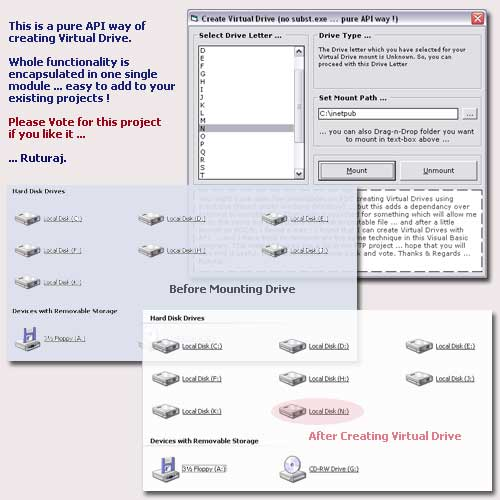



## Create Virtual Drive \(no subst\.exe \.\.\. using API\)

### Description

You might have seen few tools/codes on PSC creating Virtual Drives using subst.exe (found under windows directory) ... but this adds a dependancy over external executable file. Have you seen any code on PSC which will mount a Virtual Drive without using subst.exe ??? I haven't. Even though subst.exe is the simplest way to do it, but still, if you are like me who don't really like to Shell external executable to perform certain task, then here is the solution for you. I found that I can create Virtual Drives with API ... and I have tried to demonstrate the same technique in this Visual Basic program. It's made as easy as possible, so that you can use it in your projects without any problem. This method helped me a lot in my FTP project ... hope that you will also find it useful. If so, then please come back and vote.
 
### More Info
 

             |
---                |---
**Submitted On**   |2005-06-17 00:33:48
**By**             |[Ruturaaj](https://github.com/Planet-Source-Code/PSCIndex/blob/master/ByAuthor/ruturaaj.md)
**Level**          |Advanced
**User Rating**    |4.8 (120 globes from 25 users)
**Compatibility**  |VB 5\.0, VB 6\.0
**Category**       |[Windows API Call/ Explanation](https://github.com/Planet-Source-Code/PSCIndex/blob/master/ByCategory/windows-api-call-explanation__1-39.md)
**World**          |[Visual Basic](https://github.com/Planet-Source-Code/PSCIndex/blob/master/ByWorld/visual-basic.md)
**Archive File**   |[Create\_Vir1902636162005\.zip](https://github.com/Planet-Source-Code/ruturaaj-create-virtual-drive-no-subst-exe-using-api__1-61198/archive/master.zip)

